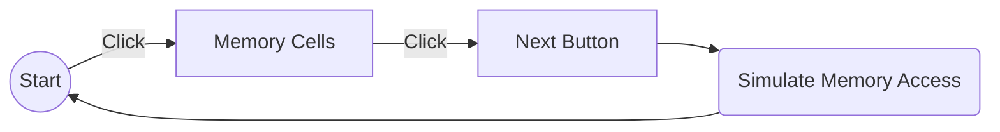

# memory-hierarchy

Demo: https://kylx.github.io/memory-hierarchy/

## Cache Memory Simulator

Memory Caching simulator is a web application that simulates caching. The application is created by the University of the Philippines Mindanao Computer Science mstudents as their final project in Computer Architecture under Dr. Jose Ildefonso U. Rubrico. The web application can help students visualize how caching works and it also aims to show a simplified way on how a cache works.

Throughout the app, users should have a good understanding of how caches work. Our app will help users answer the following questions:

1. When we copy a block of data from main memory to
the cache, where exactly should we put it?

2. How can we tell if a block  is already in the cache, or if
it has to be fetched from main memory first?

3. Eventually, the small cache memory might fill up. To
load a new block from main RAM, we’d have to replace
one of the existing blocks in the cache... which one?

### Background
The basic operations to a cache are reads and writes. If the location specified by the address and generated by CPU is stored in the cache, a hit occurs, otherwise, a miss and the request is promoted to the next memory in the hierarchy.
A block is the smallest unit of information present in the cache. Based on possible locations for a new block, three categories of cache organization are possible, in this application the cache is **direct mapped**. Meaning, the number of possible locations for each block is one. In a direct-mapped cache, the block that was checked for a hit is replaced.

When all the lines in a cache memory set become full and a new block of memory needs to be replaced into the cache memory, the cache controller must replace it with one of the old blocks in the cache. In this application the cache replacement policiy used **LRU (Least Recently Used)**. This cache replacement policy rejects the least recently used items first. This algorithm keeps track of what was used when and which is expensive to make sure the algorithm always discards the least recently used item

In the application;
- Cells above represents the Main Memory.
- Cell blocks below represents the Cache.

Instructions:

- Click or drag-click on the memory cells 
    > This will then generate a memory access pattern

- Click next button
    > - The 'V' indicates which bit is it trying to access
    > - Each click of the next button simulates memory access

### Basic Use Case

## Possible improvements
1. Show more info
    - better instructions
    - what is it supposed to do?
  
2. Generate default access patterns:
    - random
    - sequential
    - etc.

3. Save/load/compare different access patterns with each other
  
4. Ability to choose how many:
    - sets in the cache
    - blocks per cache
    - bits per size
  
5. Improved user feedback
    - more in-depth explanation per step
    - UI layout
    - animating changes

